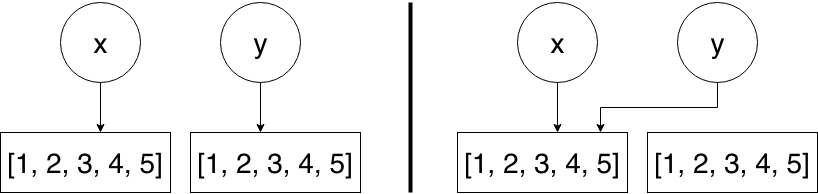

# Operators

In this section we'll have a closer look at operators in Python.
Operators are used to perform operations on variables and values.
Python divides operators in the following groups:

- Arithmetic operators
- Assignment operators
- Comparison operators
- Logical operators
- Identity operators
- Membership operators
- Bitwise operators

We'll have a look at all of them except bitwise operators as they are out of scope for this training session.


## Arithmetic Operators

Arithmetic operators are used (as the name suggests) to perform arithmetical operations on numeric variables and values (e.g. `int` and `float`).

> **Note:** Some of these arithmetic operators are implemented for more complex data structures like lists or dictionaries.
> However, they have a different meaning than the once discussed here.

| Operator | Name | Example |
|----------|------|---------|
|+|Addition|x + y|
|-|Subtraction|x - y|
|*|Multiplication|x * y|
|/|Division|x / y|
|%|Modulus|x % y|
|**|Exponentiation|x ** y|
|//|Floor division|x // y|

The following code section shows you, how you could use the operators listed above.

```python
>>> x = 5
>>> y = 3
>>> x + 2
7
>>> x + y
8
>>> x * y
15
>>> 7 / 2  # always results in a float
3.5
>>> 7 // 2  # floor-division always results in an integer
3
>>> 7 % 2  # modulo operation -> returns the remainder of a division
1
>>> 7 ** 2  # square number of 7
49
```


## Assignment Operators

Assignment operators are used to create or override variables.
Besides the *normal* assignment operator `=`, which is used in the [Variables](variables.md) section, there exist other assignment operators, which are a combination of the assignment operator and an arithmetical operator.

| Operator | Example | Same As |
|----------|---------|---------|
|=|x = 5|x = 5|
|+=|x += 3|x = x + 3|
|-=|x -= 3|x = x - 3|
|*=|x *= 3|x = x * 3|
|/=|x /= 3|x = x / 3|
|%=|x %= 3|x = x % 3|
|**=|x **= 3|x = x ** 3|
|//=|x //= 3|x = x // 3|

```python
>>> x = 5
>>> x += 3
>>> x
8
>>> x %= 2
>>> x
0
```


## Comparison Operators

Comparison operators are used to compare certain values (or variables) and get back a boolean value.
Let's assume we have two variables and want to know, whether they are equal or not:

```python
>>> x = 3
>>> y = 6
>>> x == y
False
>>> x != y
True
>>> x < y
True
```

Below you'll find a list of available comparison operators.

| Operator | Name | Example |
|----------|------|---------|
|==|Equal|x == y|
|!=|Not equal|x != y|
|>|Greater than|x > y|
|<|Less than|x < y|
|>=|Greater than or equal to|x >= y|
|<=|Less than or equal to|x <= y|


## Logical Operators

Logical operators are used to connect booleans logically to see, whether they are `True` or `False` within a certain context.

| Operator | Description | Example |
|----------|-------------|---------|
|and|Returns True if both statements are true|x < 5 and  x < 10|
|or|Returns True if one of the statements is true|x < 5 or x < 4|
|not|Reverse the result, returns False if the result is true|not(x < 5 and x < 10)|

```python
>>> x = 3 == 3
>>> x
True
>>> y = 4 < 3
>>> y
False
>>> x and y
False
>>> x and not y
True
>>> x or y
True
```


## Identity Operators

Identity operators are used to check the identity of an object.

| Operator | Description | Example |
|----------|-------------|---------|
|is|Returns true if both variables are the same object|x is y|
|is not|Returns true if both variables are not the same object|x is not y|

> **Note:** Checking whether a value is `None` (equivalent to `null` in C or Java) is performed by using the identity operator `is` and not using the comparison operator `==`.

```python
>>> x = [1, 2, 3, 4, 5]
>>> y = [1, 2, 3, 4, 5]
>>> x is y
False
>>> x is not y
True
>>> y = x
>>> x is y
True
```

The following diagram illustrates, what happended in the example provided above.



On the left-hand side you can see, that both variables point to independent lists.
However, when we set `y = x`, `y` points to the same list as `x`, which you can see on the right-hand side.


## Membership Operators

With membership operators you can check, whether a certain sequence is present in an object.
For instance you could check if the number `5` is part of a list of grades or if the name *Felix* contains the letter `p`.

```python
>>> grades = [1, 2, 3, 4, 5, 6]
>>> grades
[1, 2, 3, 4, 5, 6]
>>> 5 in grades
True
>>> name = "Felix"
>>> name
'Felix'
>>> "p" in name
False
```

| Operator | Description | Example |
|----------|-------------|---------|
|in|Returns True if a sequence with the specified value is present in the object|x in y|
|not in|Returns True if a sequence with the specified value is not present in the object|x not in y|


## Further Resources

- [Operators and Expressions in Python](https://realpython.com/python-operators-expressions/)
- [Python Operators](https://www.w3schools.com/python/python_operators.asp)
